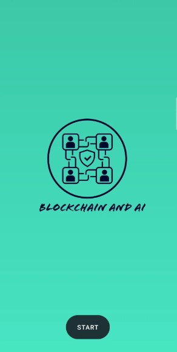
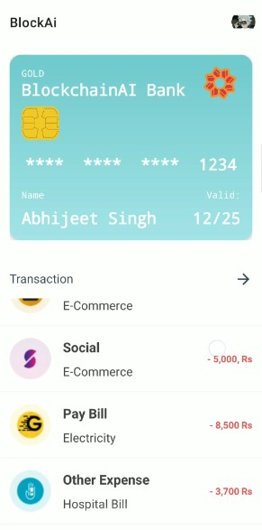
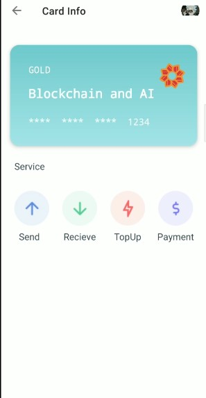
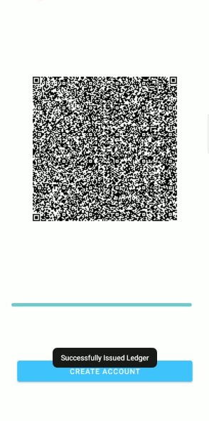
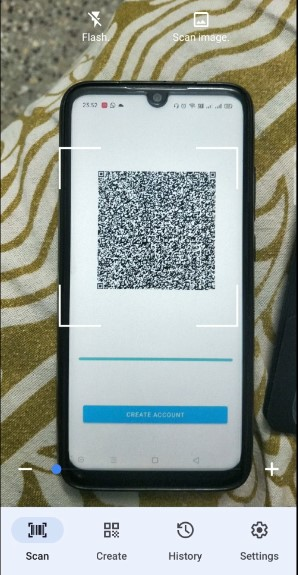
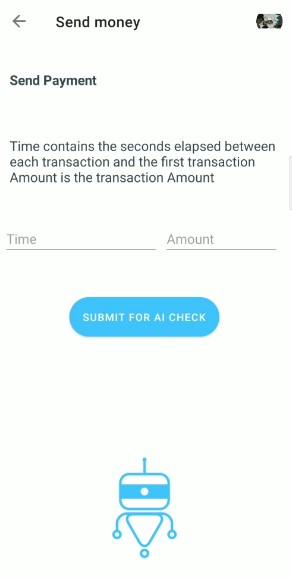

## What is BLOCKAI:
In very simplistic language BLOCKAI is banking application enabled with Self-Sovereign Identity(SSI) and Artificial Intelligence.

## How to install:

1) Clone or Download the Repo 
2) Install the Apk files in Mobile
3) When asked for ID upload SSID.txt which is a ledger.

## Impact:

User will have the transparency in the application improving in trust between Customer
Helping Customer overcome complicated restricted and wastage of time of process in secure way using blockchain and AI
User easily get onboarded to the application / KYC in seconds.
New Internet service that prevents identity modification and duplication .
Helping user to detect fraud transaction using AI

## Screenshot

## Welcome to join in and feel free to contribute.
